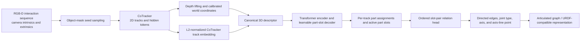

# Current Method and Pipeline Specification

This document describes the current implementation of our method as it is used in the controlled PartNet-Mobility experiments. It is intended as a technical source for writing the paper Methods section. It separates the deployable feedforward method from historical optimization-based modules and simulation-only diagnostics.

## 1. Scope and Terminology

### 1.1 Main method

The current paper method takes a calibrated RGB-D interaction sequence and a category-agnostic object mask, constructs sparse 3D trajectories, groups the trajectories into rigid part slots, and predicts a directed articulated graph and joint parameters with a learned slot-relation head.

The validation-selected main configuration is:

```text
CoTracker-only representation
  = CoTracker 2D trajectories lifted with calibrated depth
  + CoTracker frozen per-track embeddings

Kinematic backend
  = Full neural relation head
```

We refer to this configuration as **Ours Main: CoTracker + Full Neural** under the fixed-connected-body collapsed ontology. Hybrid was the earlier selection under the pre-collapse ontology and is retained only as a controlled feature ablation.

### 1.2 Meaning of feedforward

Feedforward means that, after trajectory extraction, part assignments and kinematic relations are predicted by learned networks in one forward pass. The main method does not perform test-time combinatorial clustering, iterative merge/split, EM refinement, differentiable simulation, or per-object joint optimization.

### 1.3 Simulation supervision versus inference inputs

PartNet-Mobility and MuJoCo provide semantic part IDs and joint metadata during training and evaluation. These labels supervise slot matching, topology, joint type, axis, and axis-line position. They are not intended as inference inputs. The deployable input contract contains only RGB-D observations, calibrated cameras, and an object mask.

For simulation artifacts, `original_part_id` is retained as a parallel annotation field for loss computation and evaluation. Predicted part IDs remain episode-local and permutation invariant.

## 2. Pipeline Overview



The TAPIP-only and Hybrid feature paths are retained as controlled ablations. The analytic kinematic estimators are also retained as independent backends, but neither replaces the validation-selected main configuration.

## 3. Input Acquisition

### 3.1 Observation sequence

The main PartNet training set was recorded as an eight-second articulated interaction at 15 FPS, giving 120 source frames. Each timestep contains three calibrated RGB-D views in the shared three-view protocol. Camera intrinsics, camera-to-world poses, depth maps, RGB images, and object masks are stored per frame.

The three views are independently tracked and their lifted trajectories are represented in a shared world coordinate frame. World-space fusion therefore uses known camera extrinsics rather than image-space correspondence between views.

### 3.2 Motion excitation

The simulator excites the articulated joints through smooth trajectories. Multi-joint objects use temporally differentiated or staggered motion schedules so that all parts do not exhibit identical synchronized motion. This improves observability of independent rigid components, but the learned method does not receive the commanded joint values.

### 3.3 Object-mask seeds

Initial seed pixels are sampled from the foreground object mask on a spatial grid. No semantic part mask is required by the intended inference path. Each seed defines a track query with a view index, query frame, source pixel, and backprojected reference point.

The implementation also supports birth-time-aware dynamic reseeding. At regular intervals, newly visible object-mask regions that are not covered by existing trajectories can contribute new seed points. Each dynamically created trajectory keeps its own query/reference frame. This matters for nested articulation, for example when opening a refrigerator door reveals a drawer that was invisible in the first frame.

Dynamic reseeding is an input-coverage mechanism, not a segmentation mechanism. It does not assign a semantic part to a new seed.

## 4. Three Tracking and Feature Variants

The controlled experiment compares three representations while keeping the slot architecture and downstream relation architecture fixed.

### 4.1 CoTracker-only

CoTracker processes each RGB video and predicts image trajectories and visibility. At each visible timestep, the tracked pixel is backprojected with the measured depth and calibrated camera pose:

\[
\mathbf{x}_{i,t}^{w} = \mathbf{T}_{wc,t}\,\pi^{-1}(\mathbf{u}_{i,t}, d_{i,t}, \mathbf{K}),
\]

where \(\mathbf{K}\) is the intrinsic matrix, \(d_{i,t}\) is depth, and \(\mathbf{T}_{wc,t}\) maps camera coordinates to the common world frame.

In addition to the trajectory, a forward hook captures the final hidden token entering CoTracker's flow head. Hidden tokens are averaged over time for each seed and L2-normalized. The resulting vector is the frozen tracker embedding \(\mathbf{h}^{C}_i\).

In the original controlled dataset, CoTracker uses temporal stride four over a 15 FPS source video, producing 30 trajectory timesteps at an effective 3.75 Hz.

### 4.2 TAPIP-only

TAPIP3D receives RGB, depth, camera intrinsics, camera extrinsics, and seed queries. It directly predicts 3D coordinates in world space. In the controlled dataset, TAPIP3D uses all 120 source frames at 15 Hz.

A hook captures the final UpdateFormer token sequence. For each track, the exported feature concatenates the visibility-weighted temporal mean, temporal standard deviation, and endpoint token difference, followed by L2 normalization:

\[
\mathbf{h}^{T}_i = \operatorname{norm}\left[
\operatorname{mean}_t \mathbf{z}_{i,t},
\operatorname{std}_t \mathbf{z}_{i,t},
\mathbf{z}_{i,T}-\mathbf{z}_{i,0}
\right].
\]

### 4.3 Hybrid

Hybrid is not a direct concatenation of CoTracker and TAPIP embeddings. It uses:

```text
trajectory and visibility: TAPIP3D
frozen per-track embedding: CoTracker
```

Both trackers originate from the same seed IDs, so the TAPIP3D trajectories can be paired with the corresponding CoTracker embeddings. This combination uses TAPIP3D for dense metric 3D motion and CoTracker for a strong appearance- and motion-conditioned track representation.

The Hybrid learning manifest therefore points to the TAPIP3D track artifact and the CoTracker feature artifact. Under the fixed-connected-body collapsed ontology, CoTracker-only is the validation-selected feature path; Hybrid remains a controlled feature ablation.

## 5. Canonical Per-Track Representation

### 5.1 Object canonicalization

Let \(\mathbf{r}_i\) be the visible reference position of trajectory \(i\). The episode center is the coordinate-wise median of all reference points:

\[
\mathbf{c} = \operatorname{median}_i \mathbf{r}_i.
\]

The scale is the diagonal of their axis-aligned bounding box:

\[
s = \left\|\max_i \mathbf{r}_i - \min_i \mathbf{r}_i\right\|_2.
\]

All explicit geometry is represented relative to \(\mathbf{c}\) and normalized by \(s\). This removes global translation and object-scale variation while preserving object-relative geometry.

### 5.2 Explicit 32D geometry descriptor

Each track receives an explicit geometry descriptor \(\mathbf{g}_i\in\mathbb{R}^{32}\):

1. Canonical reference position: 3 values.
2. Endpoint displacement from the reference: 3 values.
3. Maximum trajectory motion magnitude: 1 value.
4. Visibility duration ratio: 1 value.
5. Eight uniformly sampled displacement vectors: \(8\times 3=24\) values.

Thus,

\[
\mathbf{g}_i = [\tilde{\mathbf{r}}_i,\Delta\tilde{\mathbf{x}}_{i,T},m_i,v_i,
\Delta\tilde{\mathbf{x}}_{i,\tau_1},\ldots,\Delta\tilde{\mathbf{x}}_{i,\tau_8}],
\]

where tildes denote division by the object scale.

### 5.3 Final slot input

The input to the slot network is

\[
\mathbf{f}_i = [\mathbf{h}_i;\mathbf{g}_i],
\]

where \(\mathbf{h}_i\) is the frozen CoTracker or TAPIP embedding selected by the feature path. Features are standardized with the training-set mean and variance before entering the network.

The 32D geometric component is shared across all three feature paths. Consequently, the feature ablation changes the tracker trajectory/embedding source without changing the learned slot architecture.

## 6. Learned Motion-Part Slot Segmentation

### 6.1 Architecture

The slot model is a DETR-style set predictor over tracks.

1. A linear projection, LayerNorm, and GELU map each standardized track feature to a hidden token.
2. A Transformer encoder models interactions between all track tokens.
3. A fixed upper bound of \(K_{max}\) learnable part queries is decoded by cross-attention over encoded tracks.
4. Dot products between encoded track tokens and decoded slot tokens produce assignment logits.
5. A separate existence head predicts whether each slot is active.

With encoded tracks \(\mathbf{e}_i\) and decoded slots \(\mathbf{s}_k\), the assignment logit is

\[
\ell_{ik}=\frac{\mathbf{e}_i^\top\mathbf{s}_k}{\sqrt{d}}.
\]

The soft assignment is \(p_{ik}=\operatorname{softmax}_k(\ell_{ik})\).

The current default architecture uses hidden dimension 128, two Transformer encoder layers, two decoder layers, four attention heads, and at most eight slots. The fixed maximum is only a capacity bound; the number of active parts is inferred from slot-existence probabilities and is not supplied as GT \(K\).

### 6.2 Permutation-invariant supervision

Predicted slot IDs have no semantic ordering. During training, the model aligns GT parts and slots with Hungarian matching. The matching cost for GT part \(y\) and slot \(k\) is the negative mean assignment probability of tracks belonging to \(y\):

\[
C_{y,k}=-\frac{1}{|\mathcal{I}_y|}\sum_{i\in\mathcal{I}_y}p_{ik}.
\]

`scipy.optimize.linear_sum_assignment` computes the one-to-one matching in polynomial time. This replaced an earlier permutation enumeration and supports objects with different numbers of parts under one shared maximum-slot model.

### 6.3 Assignment loss

After Hungarian matching, the primary track assignment loss is inverse-part-frequency weighted cross entropy:

\[
\mathcal{L}_{assign}= -\frac{1}{N}\sum_i w_{y_i}\log p_{i,\sigma(y_i)}.
\]

This prevents large static bases from dominating small doors or drawers.

### 6.4 Dice loss

A matched-slot Dice term improves whole-part coverage:

\[
\mathcal{L}_{dice}=\frac{1}{|\mathcal{Y}|}\sum_y
\left(1-\frac{2\sum_i p_{i,\sigma(y)}\mathbb{1}[y_i=y]+\epsilon}
{\sum_i p_{i,\sigma(y)}+|\mathcal{I}_y|+\epsilon}\right).
\]

### 6.5 Local pairwise loss

The pairwise loss predicts whether two tracks belong to the same part using the dot product of their soft assignment vectors. Positive pairs are sampled within GT parts. Negative pairs are prioritized by small 3D reference-point distance, emphasizing difficult boundaries between spatially adjacent parts.

\[
\hat a_{ij}=\sum_k p_{ik}p_{jk},\qquad
\mathcal{L}_{pair}=\operatorname{BCE}(\hat a_{ij},\mathbb{1}[y_i=y_j]).
\]

### 6.6 Differentiable rigid replay loss

The physical slot regularizer asks tracks assigned to one slot to share a per-frame rigid transform. For slot \(k\) and frame \(t\), the implementation uses soft weights

\[
w_{i,k,t}=p_{ik}v_{i,t},
\]

and solves a weighted Kabsch fit

\[
(\mathbf{R}_{k,t}^{*},\mathbf{t}_{k,t}^{*})=
\arg\min_{\mathbf{R}\in SO(3),\mathbf{t}}
\sum_i w_{i,k,t}\left\|\mathbf{x}_{i,t}-(\mathbf{R}\mathbf{r}_i+\mathbf{t})\right\|_2^2.
\]

The replay residual is normalized by object scale:

\[
\mathcal{L}_{rigid}=\frac{1}{|\mathcal{V}|}\sum_{(k,t)\in\mathcal{V}}
\frac{\sum_iw_{i,k,t}\|\mathbf{x}_{i,t}-\hat{\mathbf{x}}_{i,t}\|_2^2}
{s^2\sum_iw_{i,k,t}}.
\]

The fitted Kabsch rotation is treated as a stop-gradient inner solution because planar and near-static parts can produce repeated singular values. Gradients still flow through assignment probabilities, weighted centers, and the replay residual.

This loss is different from the downstream joint-model replay loss. Slot rigid replay teaches which tracks form one rigid part; joint replay teaches how two predicted parts are connected.

### 6.7 Existence loss and total slot objective

The existence target is one for Hungarian-matched slots and zero otherwise. The slot objective is

\[
\mathcal{L}_{slot}=\mathcal{L}_{assign}
+\lambda_d\mathcal{L}_{dice}
+\lambda_p\mathcal{L}_{pair}
+\lambda_e\mathcal{L}_{exist}
+\lambda_r\mathcal{L}_{rigid}.
\]

Default weights are \(\lambda_d=0.5\), \(\lambda_p=0.25\), \(\lambda_e=0.25\), and \(\lambda_r=0.1\).

### 6.8 Slot-stage augmentation and sampling

The slot stage uses:

- shared random yaw rotation of explicit geometric channels;
- small Gaussian coordinate noise;
- part-stratified track dropout that retains at least three tracks per GT part;
- topology-balanced object sampling that repeats rare high-part-count objects;
- variable-track-count object batching with padding masks.

The slot model is trained with AdamW, learning rate \(3\times10^{-4}\), weight decay \(10^{-4}\), and gradient clipping. The best validation assignment loss selects the checkpoint.

## 7. Slot Inference

At inference, the model computes assignment and existence probabilities. Slots with

\[
\sigma(e_k)\geq 0.5
\]

are active. If no slot passes the threshold, the maximum-existence slot is retained. Each track is assigned to the highest-probability active slot, and active IDs are compacted to episode-local part IDs.

The main result does not enable post-RANSAC slot refinement. Therefore, the reported segmentation is the direct learned slot output.

## 8. Learned Pairwise Kinematic Relation Head

### 8.1 Ordered slot pairs

For every ordered pair of active slots \((a,b)\), the model predicts whether \(a\) is the parent and \(b\) is the child. Direction is learned rather than inferred from cluster size or motion heuristics.

The current relation head considers all ordered non-self pairs independently. It does not yet include a graph transformer, minimum-spanning-tree decoder, or hard tree constraint. Cycles, multiple parents, and root count can be diagnosed after inference, but the current main model does not repair the graph.

### 8.2 Slot-level motion summary

The relation head receives both the learned slot token and a soft aggregation of the explicit canonical 32D geometry descriptor:

\[
\bar{\mathbf{g}}_k=
\frac{\sum_i p_{ik}\mathbf{g}_i}{\sum_i p_{ik}+\epsilon},
\qquad
\mathbf{u}_k=[\mathbf{s}_k;\bar{\mathbf{g}}_k].
\]

This keeps the tracker embedding useful for part identity while exposing explicit 3D position and motion to the relation predictor.

### 8.3 Pair representation

For parent candidate \(a\) and child candidate \(b\), the pair feature is

\[
\boldsymbol{\phi}_{ab}=[
\mathbf{u}_a,
\mathbf{u}_b,
\mathbf{u}_b-\mathbf{u}_a,
\mathbf{u}_a\odot\mathbf{u}_b].
\]

A two-layer MLP with LayerNorm and GELU produces a pair hidden state. Independent output heads predict:

- directed edge existence;
- joint type in `{fixed, revolute, prismatic}`;
- a unit 3D axis direction;
- a normalized point on the axis line.

The predicted axis is normalized before loss computation and export. The predicted line point is converted from canonical coordinates back to world coordinates with the object center and scale.

### 8.4 What the current main relation model does not use

The codebase contains an optional per-track 32-timestep GRU and cross-track Transformer geometry branch. It encodes reference position, displacement, velocity, visibility, and normalized time before pooling tracks into part-motion tokens. This branch is useful for axis diagnostics but is not enabled by the controlled Ours Main training script.

Ours Main instead uses the learned slot token plus the soft-pooled 32D canonical descriptor described above. However, its joint replay loss still uses the complete visible 3D trajectories rather than only the eight sampled descriptor offsets.

## 9. Relation Supervision and Losses

### 9.1 GT relation construction

During simulation training, MuJoCo/PartNet joint metadata is converted to directed parent-child relations. Hungarian slot alignment maps semantic GT parts to episode-local predicted slots. This gives an edge matrix, joint-type targets, world/canonical axes, and points on revolute axis lines.

The diagonal of the ordered slot-pair matrix is excluded from training.

### 9.2 Directed edge loss

Directed edges use binary cross entropy with an increased positive weight:

\[
\mathcal{L}_{edge}=\operatorname{BCEWithLogits}(\hat e_{ab}, e_{ab}).
\]

The default positive weight is four to address the imbalance between sparse true edges and all ordered slot pairs.

### 9.3 Joint-type loss

Joint type uses cross entropy on positive GT edges. Class weights are inverse to the observed training frequency of fixed, revolute, and prismatic joints:

\[
\mathcal{L}_{type}=\operatorname{CE}_{balanced}(\hat{\mathbf{t}}_{ab},t_{ab}).
\]

### 9.4 Undirected axis-angle loss

A physical joint axis is sign ambiguous, so \(\mathbf{a}\) and \(-\mathbf{a}\) are equivalent. The model uses direct geodesic angular supervision:

\[
\mathcal{L}_{axis}=\arccos\left(|\hat{\mathbf{a}}^\top\mathbf{a}^{gt}|\right).
\]

Direct angular loss preserves gradients in the low-error regime better than \(1-\cos\theta\). It is applied to positive relations and balanced by joint type.

### 9.5 Revolute axis-line loss

For revolute joints, the position of an axis is a line rather than a unique pivot point. If \(\hat{\mathbf{p}}\) is the predicted line point, the loss is its perpendicular distance to the GT axis line:

\[
\mathcal{L}_{line}=
\left\|(\hat{\mathbf{p}}-\mathbf{p}^{gt})\times\mathbf{a}^{gt}\right\|_2.
\]

There is no pivot-position loss for prismatic joints because a translation axis has direction but no unique spatial line location.

### 9.6 Joint-model replay loss

The joint replay term uses the predicted axis and line but fits only the scalar joint coordinate for each visible frame and reference-frame group.

For a prismatic joint,

\[
\hat{\mathbf{x}}_{i,t}=\mathbf{r}_i+q_t\hat{\mathbf{a}},
\]

where \(q_t\) is the mean projection of observed displacement onto the predicted axis.

For a revolute joint,

\[
\hat{\mathbf{x}}_{i,t}=
\mathbf{R}(\hat{\mathbf{a}},q_t)(\mathbf{r}_i-\hat{\mathbf{p}})+\hat{\mathbf{p}},
\]

where \(q_t\) is fitted from the source and observed vectors projected onto the plane perpendicular to the predicted axis.

The replay loss averages the 3D residual of valid child tracks. Tracks with different birth/reference frames are handled in separate groups, avoiding an invalid shared zero state for dynamically reseeded points.

Joint replay is a regularizer, not a replacement for direct type, axis, and line supervision. A wrong axis can sometimes be partially compensated by a fitted \(q_t\), so the direct axis loss receives a larger weight.

### 9.7 Total relation objective

The relation objective is

\[
\mathcal{L}_{rel}=\mathcal{L}_{edge}
+\lambda_t\mathcal{L}_{type}
+\lambda_a\mathcal{L}_{axis}
+\lambda_l\mathcal{L}_{line}
+\lambda_j\mathcal{L}_{joint-replay}.
\]

When the slot backbone is fine-tuned, auxiliary slot assignment and slot-existence losses are added:

\[
\mathcal{L}=\mathcal{L}_{rel}
+\lambda_{sa}\mathcal{L}_{assign}
+\lambda_{se}\mathcal{L}_{exist}.
\]

Current weights are \(\lambda_t=1\), \(\lambda_a=2\), \(\lambda_l=1\), \(\lambda_j=0.1\), \(\lambda_{sa}=0.5\), and \(\lambda_{se}=0.1\).

## 10. Relation Training Schedule

Training is staged because topology and kinematic prediction are easier to stabilize after the part slots are already meaningful.

### 10.1 Phase 1: frozen slot backbone

The trained slot model is frozen and only the relation MLP and output heads are optimized for 50 epochs.

### 10.2 Phase 2: decoder-only diagnostic fine-tuning

An optional phase initializes from Phase 1 and unfreezes slot queries, Transformer decoder, and existence head at 0.1 times the relation-head learning rate. The encoder and input projection remain frozen.

### 10.3 Phase 3: full-slot fine-tuning

The final controlled checkpoints initialize the relation head from Phase 1 and unfreeze the entire slot backbone for 25 epochs. Slot parameters use a 0.1 learning-rate multiplier. Relation, assignment, and existence losses are optimized jointly.

The full-slot phase is not initialized from zero: it starts from the pretrained slot segmentation model and the frozen-relation checkpoint.

### 10.4 SO(3) augmentation

The current relation training launcher applies a random uniform-quaternion SO(3) rotation with probability 0.5. Explicit relation-level geometry, replay points, GT axes, and GT line points are rotated consistently. Opaque tracker embeddings remain unchanged.

The current `relation_geometry` scope also leaves the slot encoder input in its original orientation, even during full-slot fine-tuning. This avoids requiring the non-equivariant slot encoder to become fully rotation equivariant while still reducing axis-direction shortcuts in the relation head.

### 10.5 Optimization

The relation model uses AdamW with learning rate \(3\times10^{-4}\), weight decay \(10^{-4}\), object batch size four, and gradient clipping. CoTracker, TAPIP3D, and Hybrid relation heads are trained independently with the same schedule.

## 11. End-to-End Inference

The deployable feedforward inference can be summarized as follows.

```text
Input:
  RGB-D frames, camera calibration, object masks

1. Sample object-mask seed pixels, optionally adding dynamic birth-time seeds.
2. Track seeds and form world-space 3D trajectories.
3. Load frozen tracker embeddings.
4. Build the canonical 32D descriptor for every track.
5. Run the part-slot Transformer.
6. Select active slots from existence probabilities.
7. Assign every track to an active slot.
8. Form each slot token and soft-pooled 3D summary.
9. Evaluate every ordered active-slot pair with the relation head.
10. Threshold edge probabilities.
11. Export predicted parent, child, joint type, axis, and revolute axis line.

Output:
  episode-local part segmentation and an articulated kinematic graph
```

The learned output can be converted to the project articulation artifact and then to URDF/MJCF-compatible topology and joint parameters. Geometry proxies or reconstructed meshes are a separate downstream concern and are not required by the slot/relation predictor itself.

## 12. Analytic Kinematic Backends Used for Ablation

The codebase includes an independent relative-SE(3) estimator. It is used to determine whether explicit geometric fitting can replace or diagnose the neural axis prediction.

### 12.1 Per-frame rigid poses

For each predicted parent and child part, robust Kabsch fitting estimates per-frame poses from visible 3D correspondences. Relative motion is

\[
\mathbf{T}_{rel,t}=\mathbf{T}_{parent,t}^{-1}\mathbf{T}_{child,t}.
\]

### 12.2 Revolute estimator

The revolute estimator takes the SO(3) logarithm of each valid relative rotation, rejects frames below a minimum rotation, sign-aligns the resulting undirected axes, performs robust angular averaging, and solves a least-squares hinge line from the relative transforms. It rejects insufficiently excited cases rather than returning an arbitrary axis.

### 12.3 Prismatic estimator

The prismatic estimator applies PCA/SVD to relative translations. Confidence depends on displacement magnitude, valid-frame count, eigenvalue separation, and residual.

### 12.4 Analytic type selection

The fully analytic backend fits both revolute and prismatic hypotheses. It replays both models on the same canonical child points and selects the lower normalized point-replay RMSE. This avoids directly comparing a rotational angular residual with a translational residual.

### 12.5 Controlled backend variants

The reported backend ablation contains:

1. `full_neural`: neural edges, type, axis, and line.
2. `neural_type_analytic_axis`: neural edges and type, analytic axis/line.
3. `full_analytic`: neural edge proposals, analytic type and axis/line.

The analytic backends do not use feedforward GT type at inference. The second variant keeps neural type by design; the third independently selects type from analytic replay. Validation selected `full_neural` as the main backend.

## 13. Model Selection and Controlled Ablation

The paper ablation avoids an unnecessary 3-by-3 Cartesian table.

1. Feature path is selected on validation assignment loss among CoTracker-only, TAPIP-only, and Hybrid while fixing the neural kinematic backend.
2. Kinematic backend is selected on validation joint success at 20 degrees, then penalized axis error and type accuracy, while fixing the selected feature path.
3. The shared selected configuration appears once, producing five unique test configurations.

No test metric is used for model selection. Validation selected Hybrid features and the full neural backend.

## 14. Evaluation Protocol

### 14.1 Part segmentation

Because predicted slot IDs are arbitrary, one-to-one Hungarian matching aligns predicted and GT part IDs for evaluation. The main segmentation metrics are:

- point-domain mean IoU;
- Adjusted Rand Index (ARI);
- ordinary Rand Index (RI);
- exact predicted part-count rate;
- over- and under-segmentation statistics;
- per-object and per-category traces.

Independent best-cluster coverage is diagnostic only because one giant predicted cluster can cover several GT parts. It is not used as the primary segmentation score.

The controlled and external tables use the same method-independent evaluation domain. Raw MuJoCo bodies connected only by fixed joints are collapsed into maximal fixed-connected kinematic parts. A common labeled point cloud is backprojected from all three RGB-D views at source frame 0 with pixel stride 4 and 0.01 m voxelization. GT parts are selected by fixed-acquisition observability (at least 32 sampled mask pixels across at least two frames), without consulting any method prediction. Each method's source-frame track labels are transferred to these common reference points by nearest neighbor, followed by one-to-one Hungarian matching. The reported IoU is coverage-aware over the complete selected GT domain; ARI and RI are evaluated on covered reference points. A 1.0-bbox nearest-neighbor threshold makes geometry coverage effectively non-limiting for the controlled track predictions while preserving the same evaluator contract as external methods.

Earlier slot reports computed metrics directly on each tracker's own query population. Those tracker-domain values are retained as diagnostics but are not used as the unified Point IoU result.

### 14.2 Topology and joint type

The native relation-head report includes directed Edge F1 and joint-type accuracy. The current controlled analytic-decomposition table reports GT edge recall rather than Edge F1 because that evaluator measures recovery of GT pairs and does not count every unmatched predicted edge. These two metrics must not be presented as identical.

### 14.3 Axis angle

Axis direction is undirected:

\[
e_{axis}=\arccos\left(|\hat{\mathbf{a}}^\top\mathbf{a}^{gt}|\right).
\]

The primary conditional axis metric is computed only when the edge is recovered and the joint type is correct. A revolute joint predicted as prismatic contributes to type error, not to the conditional axis mean.

### 14.4 Axis-line distance

For type-correct revolute joints,

\[
e_{line}=\frac{
\left\|(\hat{\mathbf{p}}-\mathbf{p}^{gt})\times\mathbf{a}^{gt}\right\|_2
}{\operatorname{diag}(\operatorname{bbox}_{object})}.
\]

Prismatic joints have no axis-position metric.

### 14.5 End-to-end metrics

Conditional axis means can hide missing edges and wrong types. Therefore the controlled report also assigns a 90-degree penalty to missing edges, wrong joint types, and unavailable axes. It reports:

- failure-penalized axis error;
- joint success at 10 degrees;
- joint success at 20 degrees.

These strict metrics are used for backend selection.

### 14.6 Difficulty analysis

Results are retained per object and per joint, then aggregated by category and by GT part-count difficulty:

```text
simple:   2 parts
medium:   3-4 parts
complex:  at least 5 parts
```

## 15. Current Controlled Result Snapshot

The current common test intersection contains 116 objects and 270 GT joints. The validation-selected Ours Main result is:

| Metric | Ours Main |
|---|---:|
| Point IoU | 0.6694 |
| ARI | 0.7163 |
| RI | 0.8741 |
| Exact part-count rate | 0.6810 |
| GT edge recall | 0.8556 |
| Joint-type accuracy | 0.8852 |
| Type-correct axis mean | 14.0948 deg |
| Type-correct axis median | 1.6681 deg |
| Revolute axis-line / bbox | 0.1189 |
| Failure-penalized axis mean | 28.7136 deg |
| Joint success at 20 deg | 0.6593 |

The large difference between mean and median axis error indicates a relatively small catastrophic tail. This is why the paper should report median, percentiles, threshold counts, and end-to-end penalized metrics in addition to the conditional mean.

Performance by part-count difficulty is:

| GT parts | Point IoU | ARI | Penalized axis | Joint@20 |
|---|---:|---:|---:|---:|
| 2 | 0.7943 | 0.6535 | 4.083 deg | 0.9474 |
| 3-4 | 0.7190 | 0.7880 | 19.195 deg | 0.7933 |
| >=5 | 0.4112 | 0.6733 | 39.979 deg | 0.5061 |

These numbers are an experiment snapshot, not architectural constants. The raw source tables are stored in `outputs/partnet_core_v1_training/ours_controlled_ablation_v1/`.

## 16. Components That Are Not Part of Ours Main

The repository contains several earlier or diagnostic pipelines. They must not be described as components of the current main feedforward method unless explicitly presented as an ablation.

### 16.1 Legacy optimization-based motion segmentation

The following modules belong to the historical optimization path:

- PCA/reference alignment for part pose initialization;
- kNN spectral clustering;
- connected-component clustering;
- sequential rigid RANSAC proposals;
- post-spectral merge;
- local split/refit;
- EM-lite unmatched-cluster routing;
- quality-weighted affinity;
- articulation-aware pair compatibility.

They were important diagnostics for developing the learned slot model, but they are not used by Ours Main.

### 16.2 Legacy geometric joint inference

The older pipeline estimated per-part SE(3) poses and then fit revolute and prismatic joints with geometric replay. The new analytic backend reuses this general relative-motion idea only as a controlled evaluation backend. The validation-selected result uses the neural relation head.

### 16.3 Simulation priors

MJCF mesh, body, mass, damping, joint axis, and joint type are not inference inputs to the current feedforward model. Simulator metadata is used as supervision and ground truth only.

### 16.4 Dynamics identification

MJX/MuJoCo optimization of mass, damping, friction, and other dynamic parameters is downstream of kinematic reconstruction. It is not part of the current segmentation or kinematic benchmark.

### 16.5 External reconstruction models

Hunyuan3D, Particulate, AiM, ReArt, DTA, ArtGS, VideoArtGS, GaussianArt, PARIS, and Ditto are generation tools or external baselines. They are not modules of Ours Main.

## 17. Current Limitations

1. The relation graph is predicted pairwise without a global legal-tree decoder. Independent edge decisions can create cycles or multiple parents.
2. The slot model has a fixed maximum of eight slots, although the active count is inferred.
3. Hybrid requires aligned CoTracker and TAPIP3D seed IDs and currently depends on CUDA for TAPIP3D feature generation.
4. The main relation representation compresses trajectories into a 32D slot summary. Full per-timestep cross-track motion encoding remains experimental.
5. Complex objects with at least five parts show the largest segmentation and end-to-end kinematic degradation.
6. Axis error has a catastrophic tail despite a low median, motivating confidence-aware or analytic fallback research.
7. The simulator provides clean RGB-D calibration and object masks. Real-world performance additionally depends on depth quality, camera-pose quality, and mask stability.

## 18. Compact Paper-Style Algorithm

```text
Algorithm: Feedforward articulated reconstruction from object-mask RGB-D video

Input:
  calibrated RGB-D observations O
  foreground masks M
  maximum slot count Kmax

Track extraction:
  sample foreground queries Q from M
  optionally reseed newly visible uncovered regions
  estimate 3D trajectories X and visibility V
  extract frozen tracker embeddings H

Track representation:
  canonicalize reference positions and displacements by object center c and scale s
  build explicit geometry descriptors G
  F <- concatenate(H, G)

Part segmentation:
  E <- TransformerEncoder(F)
  S <- TransformerDecoder(learnable_queries, E)
  P_ik <- softmax(E_i dot S_k)
  A <- slots whose existence probability exceeds threshold
  z_i <- argmax over active slots A

Kinematic graph:
  gbar_k <- soft assignment pooling of G into slot k
  u_k <- concatenate(S_k, gbar_k)
  for every ordered active pair (a, b):
      phi_ab <- [u_a, u_b, u_b-u_a, u_a*u_b]
      predict directed edge, type, axis, and axis-line point

Output:
  track-to-part labels z
  directed articulated graph with joint parameters
```

## 19. Suggested Methods Section Organization

A concise paper Methods section can be organized as:

1. **Problem formulation:** calibrated RGB-D interaction, object mask, unknown part count and kinematic tree.
2. **3D track representation:** CoTracker/TAPIP3D, depth lifting, canonical geometry, Hybrid representation.
3. **Rigid motion-part slots:** Transformer encoder-decoder, Hungarian supervision, existence prediction, rigid replay.
4. **Kinematic relation prediction:** ordered slot pairs, topology/type/axis/line heads, joint replay.
5. **Training:** staged slot then relation training, balancing, augmentation, full-slot fine-tuning.
6. **Inference and export:** active-slot decoding, edge thresholding, articulation artifact.
7. **Analytic diagnostic backend:** relative SE(3) fitting as an ablation rather than the main model.

## 20. Primary Implementation Map

| Function | Implementation |
|---|---|
| RGB-D tracking and CoTracker feature capture | `src/rgbd_urdf_mvp/perception/part_tracking.py` |
| TAPIP3D import and multi-view world-frame merge | `src/rgbd_urdf_mvp/perception/tapip3d_adapter.py` |
| TAPIP3D frozen feature export | `scripts/export_tapip3d_encoder_features.py` |
| Slot model, Hungarian matching, and rigid replay | `src/rgbd_urdf_mvp/perception/motion_part_slots.py` |
| Pairwise relation head and joint replay | `src/rgbd_urdf_mvp/kinematics/pairwise_relation_head.py` |
| Analytic relative-SE(3) backend | `src/rgbd_urdf_mvp/kinematics/analytic_joint_axis.py` |
| Three tracker-feature benchmark | `scripts/run_three_tracker_slot_benchmark.py` |
| Staged relation training | `scripts/run_three_relation_training.py` |
| Controlled five-configuration report | `scripts/summarize_ours_controlled_ablation.py` |
| Controlled results | `outputs/partnet_core_v1_training/ours_controlled_ablation_v1/` |
